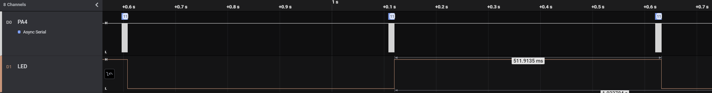
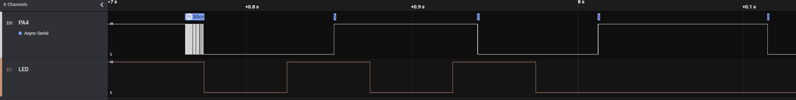
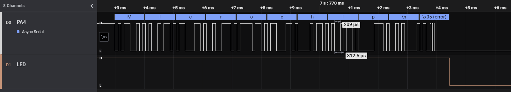
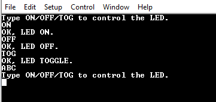
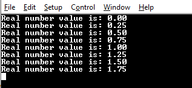
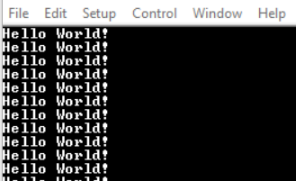
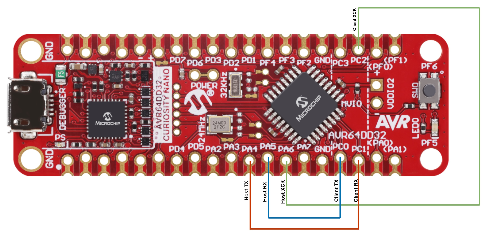
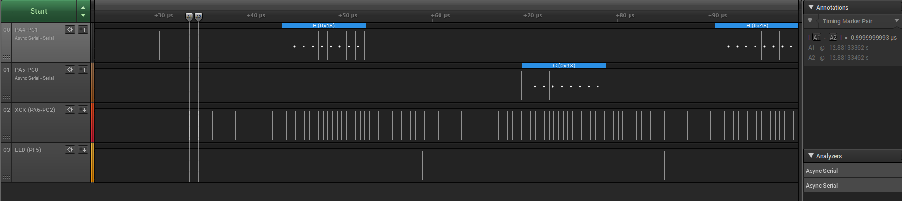

<!-- Please do not change this html logo with link -->

# Getting Started with USART Using the AVR64DD32 Microcontroller

 The repository contains five MPLAB® X projects:

1.  [One Wire Mode](#1-one-wire-mode) – This code example shows how to configure the Universal Synchronous and Asynchronous Receiver and Transmitter (USART) in One-Wire mode.
2.  [Receive Control Commands](#2-receive-control-commands) – This code example demonstrates how to send formatted messages through USART using `printf`.
3.  [Send Formatted String using printf](#3-send-formatted-strings-using-printf) This example code shows how to use USART to allow the microcontroller to receive commands via command-line.
4.  [Send Hello World](#4-send-hello-world) – This code example shows how to send the string `Hello world!\r\n` through the USART peripheral. 
5.  [Synchronous Mode](#5-synchronous-mode) – This code example shows how to use USART in Synchronous mode by connecting two USART instances and making them communicate with each other.

## Related Documentation

More details and code examples on the AVR64DD32 can be found at the following links:

- [AVR64DD32 Product Page](https://www.microchip.com/wwwproducts/en/AVR64DD32)
- [AVR64DD32 Code Examples on GitHub](https://github.com/microchip-pic-avr-examples?q=AVR64DD32)
- [AVR64DD32 Project Examples in START](https://start.atmel.com/#examples/AVR64DD32CuriosityNano)

## Software Used

- [MPLAB® X IDE](http://www.microchip.com/mplab/mplab-x-ide) v6.15 or newer
- [MPLAB® XC8](http://www.microchip.com/mplab/compilers) v2.41 or newer
- [AVR-Dx Series Device Pack](https://packs.download.microchip.com/) v2.3.272 or newer

## Hardware Used

- Logic Analyzer
- The AVR64DD32 Curiosity Nano Development Board is used as a test platform
   

## Operation

To program the Curiosity Nano board with this MPLAB® X project, follow the steps provided in the [How to Program the Curiosity Nano Board](#how-to-program-the-curiosity-nano-board) chapter.  

## 1. One-Wire Mode

This program shows how to configure USART in One-Wire mode. In this mode, the Receive (RX) and Transmit (TX) functions use the same pin, and the communication becomes half-duplex. To check for bus conflicts, the transmitted characters loopback to the receive buffer and are compared. The pin is configured by the hardware in Open-Drain mode, allowing multiple transmitters to run on the same bus.
The application sends the string `Microchip\n\r` every 500 ms through the PA4 pin while checking for the data integrity. When the transmitted data is received, the LED will blink at a rate of 1 Hz. If the integrity check fails or the data is not received, the LED blinks faster, as shown in the picture from the Demo section.

### 1.1 Setup

The following configurations must be made for this project:

- System clock configured at 4 MHz
- USART0:
	- 9600 baud rate
	- 8 data bits
	- no parity bit
	- 1 stop bit
	- Loopback mode enabled
	- Open-drain enabled 
	- RX and TX enabled

 | Pin                     | Configuration                                       |
 | :---------------------: | :-------------------------------------------------: |
 |            PA4          |   RX/TX – digital input (initial configuration)     |
 |            PF5          |   LED - Digital Output							     |

### 1.2 Demo

When sending a character, the received character works as a cofirmation loopback. If the received character is identical with the sent character, the transmission is successful.

Possible errors are:

- Interference with another transmitter on the same line
- Line held down by an external device or by hardware malfunction

The image below shows the transmitting pin (PA4) together with the LED (PF5) toggling after every successful transmission.
 

The image below shows the transmitting pin (PA4) together with the LED (PF5) after an error on the communication line (PA4) occured. The LED toggles every 50 ms, signaling the error.
 

The image below shows the transmitting pin (PA4) when an error occurs at the last character of the string.
 

### 1.3 Summary

This project shows how to use the USART peripheral in One-Wire mode, in which both the transmitting and the receiving are implemented using the same pin.

[Back to top](#getting-started-with-usart-using-the-avr64dd32-microcontroller) 

## 2. Receive Control Commands

This project shows how to use USART to implement a command-line interface. This way, the microcontroller can receive control commands via USART. It is convenient to use the line terminator `\n\r` as a command delimiter so that USART will read complete lines. The application can decode:

- the `ON` command, and it will turn on the LED and reply with `OK, LED ON.\n\r`
- the `OFF` command, and it will turn off the LED and reply with `OK, LED OFF.\n\r`
- the `TOG` command, and it will toggle the LED and reply with `OK, LED TOGGLE.\n\r`
- for any other command, it will reply with `Type ON/OFF/TOG to control the LED.\n\r`

### 2.1 Setup

The following configurations must be made for this project:

- Clock frequency set to 4 MHz
- USART0:
	- 115200 baud rate
	- 8 data bits
	- no parity bit
	- 1 stop bit
	- RX and TX pins enabled (PD4 and PD5)

 | Pin                     | Configuration      |
 | :---------------------: | :----------------: |
 |            PD4  (TX)    |   Digital output   |
 |            PD5  (RX)    |   Digital input    |
 |            PF5  (LED)   |   Digital output   |

### 2.2 Demo

**Note**: Open the terminal before programming the device. The help command `Type ON/OFF/TOG to control the LED.` will be received.

 

In this demo, commands are sent via serial communication and a terminal receives the confirmation messages.
 Right after the initialization, the board sends the `Type ON/OFF/TOG to control the LED.` message. Then, it follows the behavior detailed in the description of this README.

### 2.3 Summary

This project shows how to use the USART peripheral to implement a command-line interface.

[Back to top](#getting-started-with-usart-using-the-avr64dd32-microcontroller) 

## 3. Send Formatted Strings Using `printf`

This example demonstrates how to send formatted messages through USART using `printf`. It sends the value of a floating-point counter every 500 ms as a message and then increases the counter.

### 3.1 Setup

The following configurations must be made for this project: 

- Clock frequency set to 4 MHz
- USART0 configuration:
	- 115200 baud rate
	- 8 data bits
	- no parity bit
	- 1 stop bit
	- TX pin enabled (PD4)

 | Pin                     | Configuration      |
 | :---------------------: | :----------------: |
 |      PD4 (USART0 TX)    |   Digital output   |

### 3.2 Demo

 

In this demo, the value of an increasing floating-point counter is transmitted in the form of `Real number value is: <counter_value>\n\r`.

### 3.3 Summary

This project shows how to use the USART peripheral to send formatted strings.

[Back to top](#getting-started-with-usart-using-the-avr64dd32-microcontroller) 

## 4. Send 'Hello World!'

This project shows how to send the string `Hello world!\n\r` through the USART peripheral every 1000 ms.

### 4.1 Setup

The following configurations must be made for this project:

- System clock configured at 4 MHz
- USART0:
	- 115200 baud rate
	- 8 data bits
	- no parity bit
	- 1 stop bit
	- TX pin enabled (PD4)

 | Pin                     | Configuration      |
 | :---------------------: | :----------------: |
 |            PD4          |   Digital output   |

### 4.2 Demo

In this demo, the message `Hello World!` is sent via serial communication every 1000 ms.

 

### 4.3 Summary

This project shows how to send a string via serial communication using the USART peripheral.

[Back to top](#getting-started-with-usart-using-the-avr64dd32-microcontroller) 

## 5. Synchronous Mode

This project shows how to use Synchronous mode for the USART peripheral by connecting two instances and making them communicate with each other. In Synchronous mode, the XCK pin is required. The instance that acts as Host provides the clock on the XCK pin and the Client instance receives the clock on the XCK pin. This program sends the character `H` from one instance and the character `C` from the other, repeatedly.

### 5.1 Setup

The following configurations must be made for this project:

- Clock frequency set at 4 MHz
- Global interrupts enabled
- USART0 and USART1:
	- 1 Mbaud rate
	- 8 data bits
	- no parity bit
	- 1 stop bit
	- Synchronous mode enabled
	- RX and TX pins enabled
	- Receive interrupt enabled

 | Pin                     | Configuration            |
 | :---------------------: | :---------------------:  |
 |            PC0          |   TX1 – Digital output   |
 |            PC1          |   RX1 – Digital input    |
 |            PC2          |   XCK1 – Digital output  |
 |            PA4          |   TX0 – Digital output   |
 |            PA5          |   RX0 – Digital input    |
 |            PA6          |   XCK0 – Digital input   |

**Note**: Make sure the pairs PC2-PA6, PC0-PA5 and PC1-PA4 are connected via jumper wires, as in the diagram below.
 

### 5.2 Demo

The character `H` is transmitted by USART0 and received by USART1. Then `C` is transmitted by USART1 and received by USART0.

 

### 5.3 Summary

This project shows how to use the USART peripheral in Synchronous mode with a Clock Reference signal. USART0 and USART1, were configured in the Synchronous mode, where an additional clock pin, XCK, is used.

[Back to top](#getting-started-with-usart-using-the-avr64dd32-microcontroller) 

## How to Program the Curiosity Nano Board

This chapter shows how to use the MPLAB® X IDE to program an AVR® device with an Example_Project.X. This can be applied to any other projects.

- Connect the board to the PC

- Open the Example_Project.X project in MPLAB® X IDE

- Set the Example_Project.X project as main project

  - Right click the project in the **Projects** tab and click **Set as Main Project**
     

- Clean and build the Example_Project.X project

  - Right click the **Example_Project.X** project and select **Clean and Build**
     

- Select **AVRxxxxx Curiosity Nano** in the Connected Hardware Tool section of the project settings:

  - Right click the project and click **Properties**
  - Click the arrow under the Connected Hardware Tool
  - Select the **AVRxxxxx Curiosity Nano** (click the **SN**), click **Apply** and then **OK**:
     

- Program the project to the board
  - Right click the project and then **Make and Program Device**
     

 

- [Back to 1. One-Wire Mode](#1-one-wire-mode)
- [Back to 2. Receive Control Commands](#2-receive-control-commands) 
- [Back to 3. Send Formatted String Using printf](#3-send-formatted-strings-using-printf) 
- [Back to 4. Send Hello World](#4-send-hello-world) 
- [Back to 5. Synchronous Mode](#5-synchronous-mode)
- [Back to top](#getting-started-with-usart-using-the-avr64dd32-microcontroller) 

